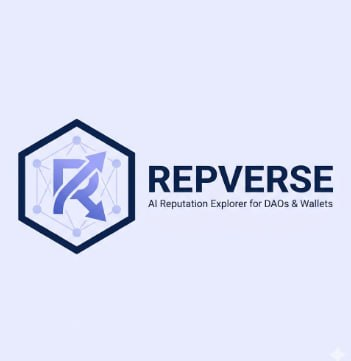

# REPVERSE — AI Reputation Explorer

> AI-powered contributor intelligence platform for DAOs & wallets, built on Zero Authority DAO.



## What It Does

REPVERSE lets you enter a username or wallet address and instantly get:

- **AI-generated reputation summary** (powered by Claude)
- **Trust score & grade** (S / A / B / C / D / F)
- **Contribution breakdown** — bounties, quests, gigs, endorsements
- **Contribution heatmap** (past year of activity)
- **DAO involvement** and governance analytics
- **Live leaderboard** of top contributors
- **Live bounties** from Zero Authority DAO

---

## Stack

| Layer | Tech |
|-------|------|
| Frontend | EJS templates (no frontend frameworks) |
| Backend | Node.js + Express.js |
| Database | MongoDB (optional — app works without it) |
| API | Zero Authority DAO REST API |
| AI | Anthropic Claude (claude-sonnet-4) |
| Deploy | Render |

---

## Quick Start (Local)

```bash
# 1. Clone the repo
git clone https://github.com/YOUR_USERNAME/repverse.git
cd repverse

# 2. Install dependencies
npm install

# 3. Create .env (copy from .env.example)
cp .env.example .env

# 4. Fill in your .env values (see below)

# 5. Run
npm start
# or for dev with auto-reload:
npm run dev
```

Visit `http://localhost:3000`

---

## Environment Variables

Copy `.env.example` to `.env` and fill in:

```env
PORT=3000
MONGODB_URI=mongodb+srv://...        # MongoDB Atlas URI (optional)
ZA_API_BASE=https://zeroauthoritydao.com/api/v1
ZA_API_KEY=YOUR_ZERO_AUTHORITY_KEY   # From zeroauthoritydao.com/dashboard/api-keys
ANTHROPIC_API_KEY=YOUR_CLAUDE_KEY    # From console.anthropic.com
NODE_ENV=production
```

### Getting your keys

| Key | Where to get it |
|-----|----------------|
| `ZA_API_KEY` | [zeroauthoritydao.com/dashboard/api-keys](https://zeroauthoritydao.com/dashboard/api-keys) — sign in → Dashboard → API Keys |
| `ANTHROPIC_API_KEY` | [console.anthropic.com](https://console.anthropic.com) — create account → API Keys |
| `MONGODB_URI` | [MongoDB Atlas](https://www.mongodb.com/cloud/atlas) free tier (optional) |

> **Note:** The app works WITHOUT MongoDB and WITHOUT Anthropic key. MongoDB is used for caching. Without Anthropic key, AI summaries fall back to a smart template-based summary.

---

## Deploy to Render

1. Push this repo to GitHub
2. Go to [render.com](https://render.com) → New → Web Service
3. Connect your GitHub repo
4. Set **Build Command**: `npm install`
5. Set **Start Command**: `npm start`
6. Add environment variables in Render dashboard:
   - `ZA_API_KEY` — your Zero Authority API key
   - `ANTHROPIC_API_KEY` — your Anthropic key (optional)
   - `MONGODB_URI` — your MongoDB Atlas URI (optional)
   - `NODE_ENV` = `production`
7. Deploy!

---

## API Endpoints Used

| Endpoint | Used For |
|----------|----------|
| `GET /users` | Creator list for leaderboard |
| `GET /users/:username` | Single contributor profile |
| `GET /users/search?q=` | Username search |
| `GET /bounties` | Live bounty listings |
| `GET /quests` | Quest listings |
| `GET /events` | Events |
| `GET /leaderboard` | Reputation leaderboard |
| `GET /reputation/:id` | Wallet/user reputation |

Base URL: `https://zeroauthoritydao.com/api/v1`  
Auth: `Authorization: Bearer YOUR_API_KEY`

---

## Pages & Routes

| Route | Description |
|-------|-------------|
| `/` | Landing page with hero, search, bounties, leaderboard preview |
| `/leaderboard` | Full searchable leaderboard |
| `/contributor/:username` | Public contributor profile page |
| `/api/search?q=` | Search API endpoint |
| `/api/bounties` | Bounties JSON API |
| `/api/leaderboard` | Leaderboard JSON API |
| `/api/quests` | Quests JSON API |
| `/api/events` | Events JSON API |
| `/api/creators` | Creators JSON API |

---

## Project Structure

```
repverse/
├── server.js              # Express entry point
├── package.json
├── render.yaml            # Render deployment config
├── .env.example           # Environment variables template
├── .gitignore
├── middleware/
│   ├── zaApi.js           # Zero Authority API client
│   ├── aiService.js       # Claude AI + trust score logic
│   └── models.js          # MongoDB models (optional)
├── routes/
│   ├── index.js           # Home page route
│   ├── api.js             # REST API routes
│   ├── contributor.js     # Contributor profile route
│   └── leaderboard.js     # Leaderboard route
├── views/
│   ├── index.ejs          # Landing page
│   ├── leaderboard.ejs    # Leaderboard page
│   ├── contributor.ejs    # Profile page
│   ├── 404.ejs            # 404 page
│   ├── error.ejs          # Error page
│   └── partials/
│       ├── header.ejs     # Nav + head HTML
│       └── footer.ejs     # Footer + scripts
└── public/
    ├── css/main.css       # All styles
    ├── js/main.js         # All client JS
    └── images/logo.jpg    # REPVERSE logo
```

---

## License

MIT — Build something real.
